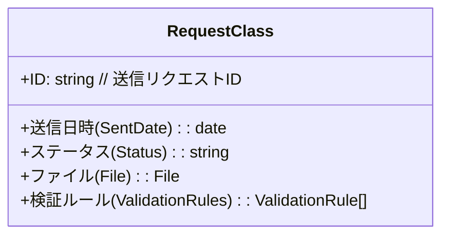

```mermaid
classDiagram
  class RequestClass {
    +ID: string // 送信リクエストID
    +送信日時 (SentDate): date
    +ステータス (Status): string
    +ファイル (File): File
    +検証ルール (ValidationRules): ValidationRule[]
  }
```

