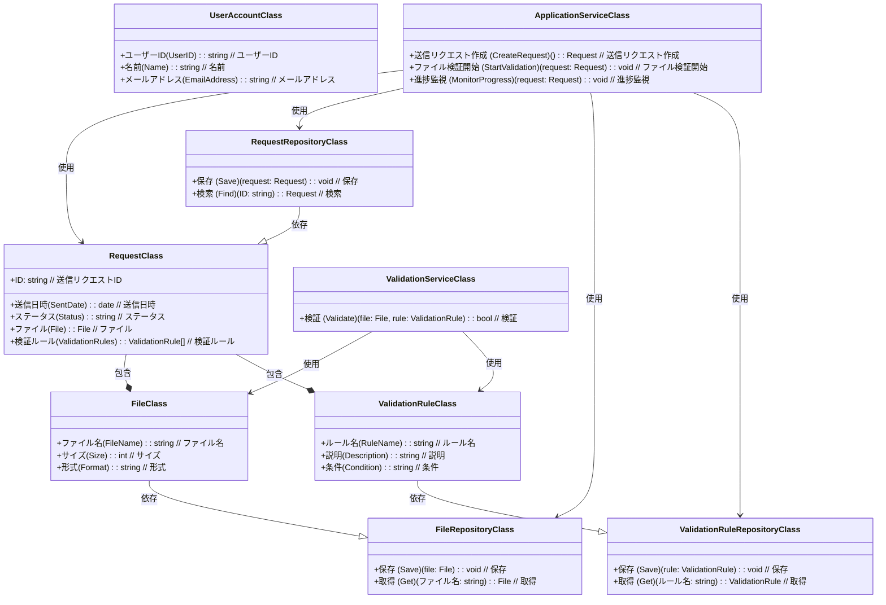

```mermaid
classDiagram
  class RequestClass {
    +ID: string // 送信リクエストID
    +送信日時 (SentDate): date // 送信日時
    +ステータス (Status): string // ステータス
    +ファイル (File): File // ファイル
    +検証ルール (ValidationRules): ValidationRule[] // 検証ルール
  }
  
  class FileClass {
    +ファイル名 (FileName): string // ファイル名
    +サイズ (Size): int // サイズ
    +形式 (Format): string // 形式
  }

  class ValidationRuleClass {
    +ルール名 (RuleName): string // ルール名
    +説明 (Description): string // 説明
    +条件 (Condition): string // 条件
  }

  class UserAccountClass {
    +ユーザーID (UserID): string // ユーザーID
    +名前 (Name): string // 名前
    +メールアドレス (EmailAddress): string // メールアドレス
  }

  class RequestRepositoryClass {
    +保存 (Save)(request: Request): void // 保存
    +検索 (Find)(ID: string): Request // 検索
  }

  class FileRepositoryClass {
    +保存 (Save)(file: File): void // 保存
    +取得 (Get)(ファイル名: string): File // 取得
  }

  class ValidationRuleRepositoryClass {
    +保存 (Save)(rule: ValidationRule): void // 保存
    +取得 (Get)(ルール名: string): ValidationRule // 取得
  }

  class ApplicationServiceClass {
    +送信リクエスト作成 (CreateRequest)(): Request // 送信リクエスト作成
    +ファイル検証開始 (StartValidation)(request: Request): void // ファイル検証開始
    +進捗監視 (MonitorProgress)(request: Request): void // 進捗監視
  }

  class ValidationServiceClass {
    +検証 (Validate)(file: File, rule: ValidationRule): bool // 検証
  }

  RequestClass --* FileClass : 包含
  RequestClass --* ValidationRuleClass : 包含
  FileClass --|> FileRepositoryClass : 依存
  ValidationRuleClass --|> ValidationRuleRepositoryClass : 依存
  RequestRepositoryClass --|> RequestClass : 依存
  ApplicationServiceClass --> RequestClass : 使用
  ValidationServiceClass --> FileClass : 使用
  ValidationServiceClass --> ValidationRuleClass : 使用
  ApplicationServiceClass --> RequestRepositoryClass : 使用
  ApplicationServiceClass --> FileRepositoryClass : 使用
  ApplicationServiceClass --> ValidationRuleRepositoryClass : 使用

```

